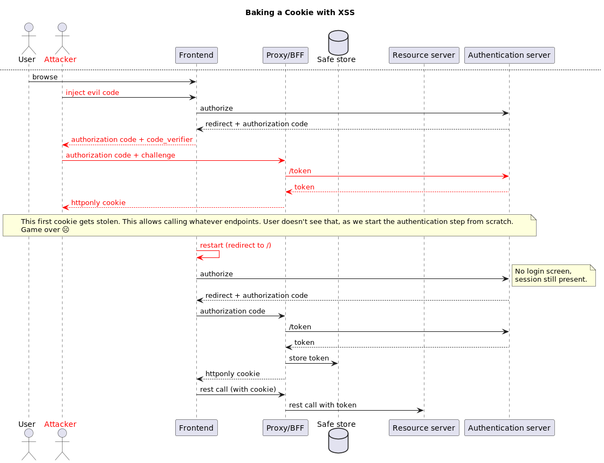

# Servicewauther
This project implements a secure [an OAuth2 Authorization Code client](https://datatracker.ietf.org/doc/html/rfc6749#section-1.3.1) by using a [Service Worker](https://developer.mozilla.org/en-US/docs/Web/API/Service_Worker_API).

# Security
## XSS and comparison with other flows
In case of successful XSS, with any security implementation (traditional session, OAuth2 with BFF, OAuth2 with Local/Session storage), it should be considered that complete compromise of the application has happened: any call to a backend API from the injected code will be authenticated with the credentials of the compromised user, be it with a cookie (which isn't inherently safe, see below) or a token.

As such, defending against XSS (and CSRF where it applies) is where most focus should be.

Still, some requirements make it important to protect credentials in case of XSS. As such, this project aims to offer a good degree of protection against stealing of credentials. 

Service workers offer additional advantages when compared to other solutions:
- They are not vulnerable to stealing of authorization codes.
- Which in turn make them not vulnerable to stealing of session identifiers (tokens or cookies).  

## Comparison with Backend-for-Frontend pattern (BFF)
There are multiple definitions of BFF, but let's use this one, often used in the context of OAuth2: a backend-for-frontend is a stateful backend that holds the token and is the path through all resource API calls pass (the BFF adding appropriate _Authentication: Bearer_ headers)

Frontends secure their communication with a BFF through a HTTPOnly cookie, which can't be stolen from Javascript.

On the other hand, as an authentication flow is visible from the frontend application, the injected code can steal that, and exchange it for a session cookie, as illustrated below. The cookie was never leaked, but a similar session can be created, giving the same credentials as the legitimate user to the attacker.

## Comparison with local/session storage
Access (and id, or worse, refresh tokens) can be accessed from injected code and transferred back to the attacker. 

As such, if security beyond successful XSS is important, a secure flow involving service workers can be considered. 
