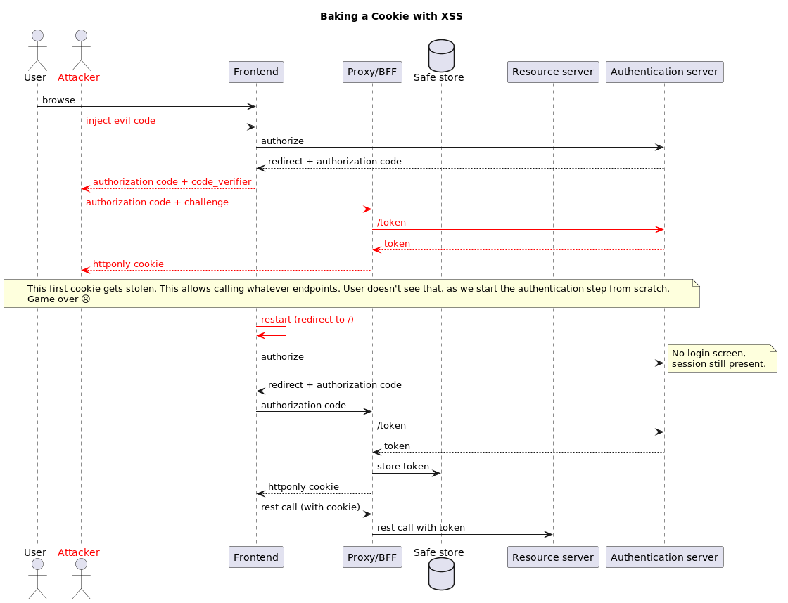

## Comparison with Backend-for-Frontend pattern (BFF)
There are multiple definitions of BFF, but let's use this one, often used in the context of OAuth2: a backend-for-frontend is a stateful backend that holds the token and is the path through all resource API calls pass (the BFF adding appropriate _Authentication: Bearer_ headers)

Frontends secure their communication with a BFF through a HTTPOnly cookie, which can't be stolen from Javascript.

On the other hand, as an authentication flow is visible from the frontend application, the injected code can steal that, and exchange it for a session cookie, as illustrated below. The cookie was never leaked, but a similar session can be created, giving the same credentials as the legitimate user to the attacker.

